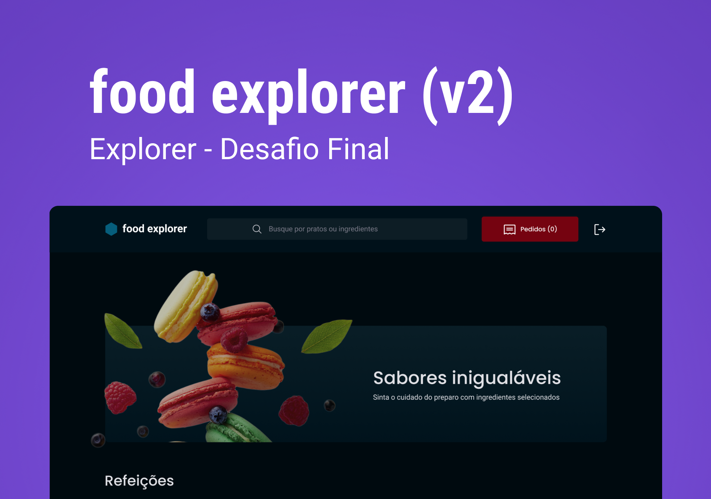

# Food Explorer - Frontend

<p align="center">
  <a href="#-technologies">Technologies</a>&nbsp;&nbsp;&nbsp;|&nbsp;&nbsp;&nbsp;
  <a href="#project">Project</a>&nbsp;&nbsp;&nbsp;|&nbsp;&nbsp;&nbsp;
  <a href="#features">Features</a>&nbsp;&nbsp;&nbsp;|&nbsp;&nbsp;&nbsp;
  <a href="#layout">Layout</a>&nbsp;&nbsp;&nbsp;|&nbsp;&nbsp;&nbsp;
  <a href="#installation">Installation</a>
</p>

<p align="center">
  
</p>

The frontend of the application is hosted on Netlify. To access it, simply
[click here.](https://boisterous-conkies-95afc5.netlify.app/)

Keep in mind that the api was deployed on a free website called [Render](https://render.com/), so it may take a while for the application to respond, and any changes you make may not persist. 

## 💻 Technologies
- React
- Vite
- Styled Components
- React Router
- Swiper
- Axios

## Project

This project was developed as part of my certification on the course Explorer, a Full-Stack web development course by Rocketseat. This is the Front-end of this project, and the back-end you can access on [this link](https://github.com/viviansanchez/rocketseat-food-explorer-backend)!

Food Explorer is an interactive website that simulates a restaurant menu. 

As this is a learning project and not meant for commercial use, you can access both roles through the below provided credentials. There are two users registered for each, and you can use the following credentials:

- Normal users registered:
  - user1:
    - email: user1@email.com
    - password: 123456

    -user2:
      - email: user1@email.com
      - password: 345678

- Admin users registered:
  - admin1:
    - email: admin1@email.com
    - password: 123456
  - admin2:
    - email: admin2@email.com
    - password: 123456

⚠️It is only possible to create normal users, not admin users. To access the admin interface, please use the credentials provided above.

⚠️Because the api was hosted on Render, information may not persist, and requests may take som time to resolve. For this reason, there are dishes that were pre registered and uploaded on the database, as well as the users mentioned above. 

⚠️Some non-required features for qualification on the course are still in development, and I will do my best to update this project on my free time, but as I pull my attention to other projects, these features may not come to fruition. 

## Features
The following are some of the core functionalities of this app:
 - user registration
 - user authentication 
 - filter through dishes by name or by ingredient tag
 - detailed view of selected dish
 - for admin users, creation of dishes, update of selected dishe information and deletion of selected dish. 

## Layout 
You can check out the Layout on Figma through [this link](https://www.figma.com/community/file/1196874589259687769).

## Instalation
To install and run this application locally on your machine please follow these steps:
1. Clone this repository through your method of choice 
2. Install the dependencies utilizing the following command: 
```
npm install
```
3. Execute the project utilizing the following command: 
```
npm run dev
```
4. Access the application on your browser of choice using the following link: 
http://localhost:5173/


🔸To consume the api on a project of your own, you can use the following link:
https://foodexplorer-api-explorer.onrender.com
